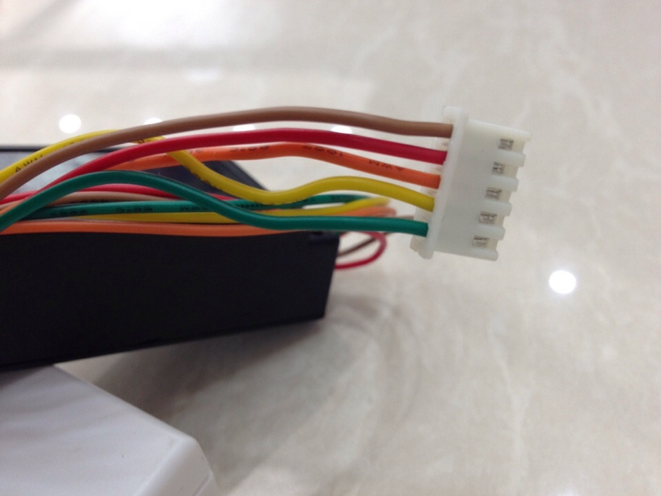

# HƯỚNG DẪN SỬ DỤNG CHUÔNG CỬA
## Sơ đồ đấu dây
		ĐỎ					-			Vcc (24V)
		NÂU					-			Mass (Gnd)
		XANH LÁ				-			Mass (Gnd)
		CAM 				- 			IN1
		VÀNG				-			IN2

## **CẢNH BÁO**
**Không được phép cấp ngược nguồn, mọi hư hỏng do cấp sai nguồn sẽ không được bảo hành.**
